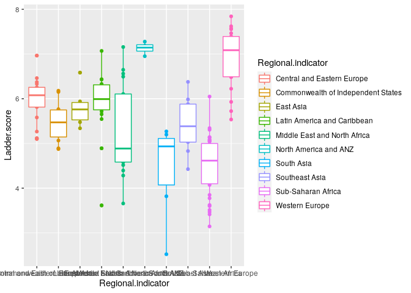
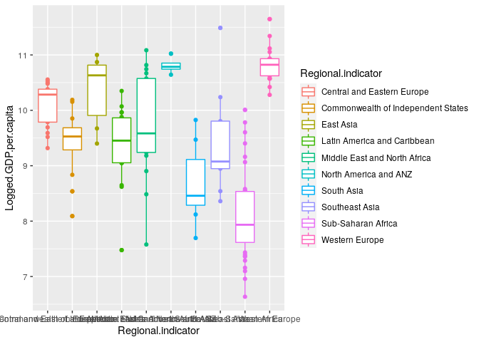
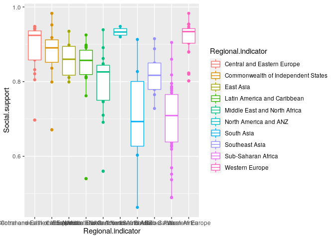
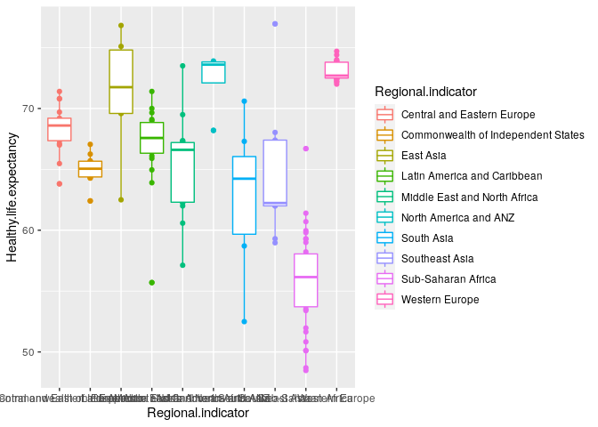
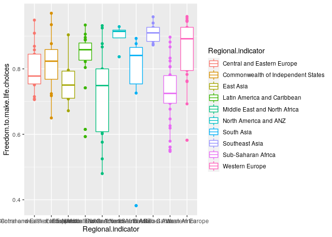
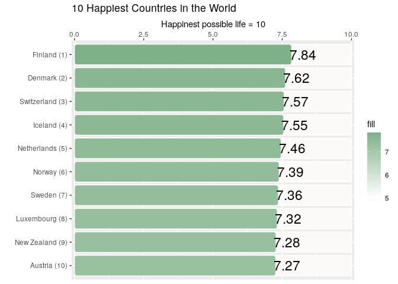
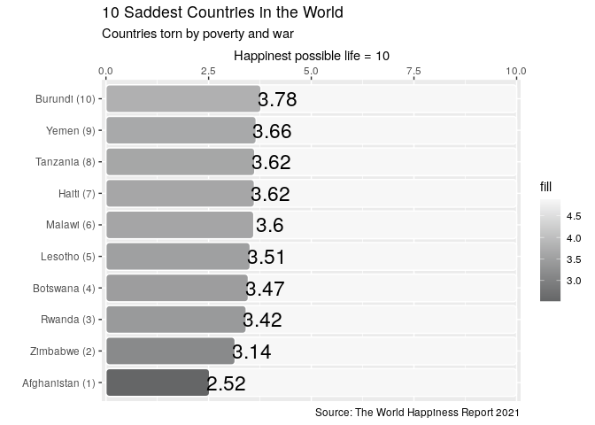
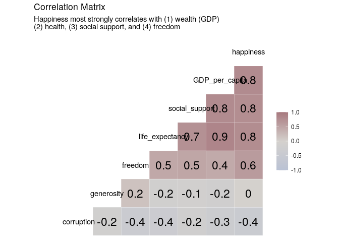

World Happiness Report 2021-Midterm Project
================
Xiaoyu Zhu
10/23/2021

# Introduction

World Happiness Report 2021 use data that come from the Gallup World
Poll surveys from 2018 to 2020. They are based on answers to the main
life evaluation question asked in the poll. This is called the Cantril
ladder: it asks respondents to think of a ladder, with the best possible
life for them being a 10, and the worst possible life being a 0. They
are then asked to rate their own current lives on that 0 to 10 scale.
The rankings are from nationally representative samples, for the years
2018-2020. They are based entirely on the survey scores, using the
Gallup weights to make the estimates representative.

the data concludes main variable that is Ladder.score, leading to the
core index of people happiness. There are other six variables that
researchers put into data frame: Logged.GDP.per.capita: means logged GDP
every captical Social.support: the quality of social support
Healthy.life.expectancy: healthy or not Freedom.to.make.life.choices:
people’s feeling on freedom to make life choice Generosity: the quality
of being kind and generous. Perceptions.of.corruption: the perceptions
of corruption

And we want to illustrates data storytelling with the World Happiness
Report (2021) data. Also we want to know what variable is related to
people happiness from perspective of country.

``` r
# install and import packages
# install.packages("ggchicklet", repos = "https://cinc.rud.is") # for rounded corners 
# install.packages("cowplot") #patch plots
# install.packages("hrbrthemes", repos = c("https://cinc.rud.is", "https://cloud.r-project.org/")) #beautiful theme
# install.packages("waffle", repos = "https://cinc.rud.is") #waffle plot
# install.packages("ggalt") #dumbell plot
# install.packages("GGally") # correlation matrix
# install.packages("remotes") # to install the relative weight package
# remotes::install_github("martinctc/rwa") # relative weight analysis
```

``` r
# import library
library(tidyverse) 
library(ggchicklet)
library(cowplot)
library(hrbrthemes)
library(ggalt)
library(GGally)
library(rwa)
library(psych)
```

``` r
#read the data
happy_2021<-read.csv("world-happiness-report-2021.csv")
```

# Method

``` r
#briefly check the data
head(happy_2021)
```

    ##   Country.name Regional.indicator Ladder.score Standard.error.of.ladder.score
    ## 1      Finland     Western Europe        7.842                          0.032
    ## 2      Denmark     Western Europe        7.620                          0.035
    ## 3  Switzerland     Western Europe        7.571                          0.036
    ## 4      Iceland     Western Europe        7.554                          0.059
    ## 5  Netherlands     Western Europe        7.464                          0.027
    ## 6       Norway     Western Europe        7.392                          0.035
    ##   upperwhisker lowerwhisker Logged.GDP.per.capita Social.support
    ## 1        7.904        7.780                10.775          0.954
    ## 2        7.687        7.552                10.933          0.954
    ## 3        7.643        7.500                11.117          0.942
    ## 4        7.670        7.438                10.878          0.983
    ## 5        7.518        7.410                10.932          0.942
    ## 6        7.462        7.323                11.053          0.954
    ##   Healthy.life.expectancy Freedom.to.make.life.choices Generosity
    ## 1                    72.0                        0.949     -0.098
    ## 2                    72.7                        0.946      0.030
    ## 3                    74.4                        0.919      0.025
    ## 4                    73.0                        0.955      0.160
    ## 5                    72.4                        0.913      0.175
    ## 6                    73.3                        0.960      0.093
    ##   Perceptions.of.corruption Ladder.score.in.Dystopia
    ## 1                     0.186                     2.43
    ## 2                     0.179                     2.43
    ## 3                     0.292                     2.43
    ## 4                     0.673                     2.43
    ## 5                     0.338                     2.43
    ## 6                     0.270                     2.43
    ##   Explained.by..Log.GDP.per.capita Explained.by..Social.support
    ## 1                            1.446                        1.106
    ## 2                            1.502                        1.108
    ## 3                            1.566                        1.079
    ## 4                            1.482                        1.172
    ## 5                            1.501                        1.079
    ## 6                            1.543                        1.108
    ##   Explained.by..Healthy.life.expectancy
    ## 1                                 0.741
    ## 2                                 0.763
    ## 3                                 0.816
    ## 4                                 0.772
    ## 5                                 0.753
    ## 6                                 0.782
    ##   Explained.by..Freedom.to.make.life.choices Explained.by..Generosity
    ## 1                                      0.691                    0.124
    ## 2                                      0.686                    0.208
    ## 3                                      0.653                    0.204
    ## 4                                      0.698                    0.293
    ## 5                                      0.647                    0.302
    ## 6                                      0.703                    0.249
    ##   Explained.by..Perceptions.of.corruption Dystopia...residual
    ## 1                                   0.481               3.253
    ## 2                                   0.485               2.868
    ## 3                                   0.413               2.839
    ## 4                                   0.170               2.967
    ## 5                                   0.384               2.798
    ## 6                                   0.427               2.580

``` r
describe(happy_2021)
```

    ##                                            vars   n  mean    sd median trimmed
    ## Country.name*                                 1 149 75.00 43.16  75.00   75.00
    ## Regional.indicator*                           2 149  6.06  3.15   6.00    6.19
    ## Ladder.score                                  3 149  5.53  1.07   5.53    5.54
    ## Standard.error.of.ladder.score                4 149  0.06  0.02   0.05    0.06
    ## upperwhisker                                  5 149  5.65  1.05   5.62    5.66
    ## lowerwhisker                                  6 149  5.42  1.09   5.41    5.43
    ## Logged.GDP.per.capita                         7 149  9.43  1.16   9.57    9.48
    ## Social.support                                8 149  0.81  0.11   0.83    0.83
    ## Healthy.life.expectancy                       9 149 64.99  6.76  66.60   65.40
    ## Freedom.to.make.life.choices                 10 149  0.79  0.11   0.80    0.80
    ## Generosity                                   11 149 -0.02  0.15  -0.04   -0.03
    ## Perceptions.of.corruption                    12 149  0.73  0.18   0.78    0.76
    ## Ladder.score.in.Dystopia                     13 149  2.43  0.00   2.43    2.43
    ## Explained.by..Log.GDP.per.capita             14 149  0.98  0.40   1.02    0.99
    ## Explained.by..Social.support                 15 149  0.79  0.26   0.83    0.82
    ## Explained.by..Healthy.life.expectancy        16 149  0.52  0.21   0.57    0.53
    ## Explained.by..Freedom.to.make.life.choices   17 149  0.50  0.14   0.51    0.51
    ## Explained.by..Generosity                     18 149  0.18  0.10   0.16    0.17
    ## Explained.by..Perceptions.of.corruption      19 149  0.14  0.11   0.10    0.12
    ## Dystopia...residual                          20 149  2.43  0.54   2.51    2.46
    ##                                              mad   min    max  range  skew
    ## Country.name*                              54.86  1.00 149.00 148.00  0.00
    ## Regional.indicator*                         4.45  1.00  10.00   9.00 -0.24
    ## Ladder.score                                1.04  2.52   7.84   5.32 -0.10
    ## Standard.error.of.ladder.score              0.02  0.03   0.17   0.15  1.85
    ## upperwhisker                                1.02  2.60   7.90   5.31 -0.11
    ## lowerwhisker                                1.06  2.45   7.78   5.33 -0.09
    ## Logged.GDP.per.capita                       1.46  6.64  11.65   5.01 -0.34
    ## Social.support                              0.11  0.46   0.98   0.52 -0.92
    ## Healthy.life.expectancy                     6.83 48.48  76.95  28.48 -0.51
    ## Freedom.to.make.life.choices                0.12  0.38   0.97   0.59 -0.74
    ## Generosity                                  0.15 -0.29   0.54   0.83  0.99
    ## Perceptions.of.corruption                   0.12  0.08   0.94   0.86 -1.55
    ## Ladder.score.in.Dystopia                    0.00  2.43   2.43   0.00   NaN
    ## Explained.by..Log.GDP.per.capita            0.51  0.00   1.75   1.75 -0.34
    ## Explained.by..Social.support                0.25  0.00   1.17   1.17 -0.92
    ## Explained.by..Healthy.life.expectancy       0.21  0.00   0.90   0.90 -0.51
    ## Explained.by..Freedom.to.make.life.choices  0.14  0.00   0.72   0.72 -0.74
    ## Explained.by..Generosity                    0.10  0.00   0.54   0.54  0.99
    ## Explained.by..Perceptions.of.corruption     0.07  0.00   0.55   0.55  1.55
    ## Dystopia...residual                         0.48  0.65   3.48   2.83 -0.55
    ##                                            kurtosis   se
    ## Country.name*                                 -1.22 3.54
    ## Regional.indicator*                           -1.42 0.26
    ## Ladder.score                                  -0.43 0.09
    ## Standard.error.of.ladder.score                 5.96 0.00
    ## upperwhisker                                  -0.40 0.09
    ## lowerwhisker                                  -0.45 0.09
    ## Logged.GDP.per.capita                         -0.86 0.09
    ## Social.support                                 0.30 0.01
    ## Healthy.life.expectancy                       -0.62 0.55
    ## Freedom.to.make.life.choices                   0.31 0.01
    ## Generosity                                     1.48 0.01
    ## Perceptions.of.corruption                      2.07 0.01
    ## Ladder.score.in.Dystopia                        NaN 0.00
    ## Explained.by..Log.GDP.per.capita              -0.86 0.03
    ## Explained.by..Social.support                   0.30 0.02
    ## Explained.by..Healthy.life.expectancy         -0.62 0.02
    ## Explained.by..Freedom.to.make.life.choices     0.32 0.01
    ## Explained.by..Generosity                       1.48 0.01
    ## Explained.by..Perceptions.of.corruption        2.07 0.01
    ## Dystopia...residual                            0.35 0.04

``` r
# see the distribution of people happiness
happy_2021%>%
ggplot(aes(x=Regional.indicator,y=Ladder.score,color=Regional.indicator))+
  geom_point()+
  geom_boxplot()
```

<!-- -->

``` r
# see the distribution of GDP
happy_2021%>%
ggplot(aes(x=Regional.indicator,y=Logged.GDP.per.capita,color=Regional.indicator))+
  geom_point()+
  geom_boxplot()
```

<!-- -->

``` r
# see the distribution of social support
happy_2021%>%
ggplot(aes(x=Regional.indicator,y=Social.support,color=Regional.indicator))+
  geom_point()+
  geom_boxplot()
```

<!-- -->

``` r
# see the distribution of life expectancy
happy_2021%>% 
ggplot(aes(x=Regional.indicator,y=Healthy.life.expectancy,color=Regional.indicator))+
  geom_point()+
  geom_boxplot()
```

<!-- -->

``` r
# see the distribution of freedom to make life choices
happy_2021%>%
ggplot(aes(x=Regional.indicator,y=Freedom.to.make.life.choices,color=Regional.indicator))+
  geom_point()+
  geom_boxplot()
```

<!-- -->

# Preliminary Result

## Fig 1. Ten happinest countries in the world

``` r
# dimensions
dimensions <- c('Ladder.score','Logged.GDP.per.capita','Social.support','Healthy.life.expectancy','Freedom.to.make.life.choices','Generosity','Perceptions.of.corruption')

# map country to regions
country_region_dict = happy_2021 %>% select(country = Country.name, region = Regional.indicator) %>% unique()

happy_2021_long <- happy_2021 %>% 
    select(country = Country.name, all_of(dimensions)) %>%
    mutate(absence_of_corruption = 1- Perceptions.of.corruption) %>%
    pivot_longer(cols = c(all_of(dimensions),'absence_of_corruption'), names_to = 'dimension', values_to = 'score') %>%
    filter(dimension != "Perceptions.of.corruption")

happy_2021_tranformed <- happy_2021_long %>%
    group_by(dimension) %>%
    mutate(min_value = min(score),
             max_value = max(score)) %>%
    mutate(score_pct = (score-min_value)/(max_value-min_value)) %>%
    ungroup()

# get top 10
happy_2021_top10 <- happy_2021_tranformed %>%
    filter(dimension == "Ladder.score") %>%
    slice_max(score, n = 10) %>%
    mutate(cat = 'top_10', 
           country_rank = rank(-score),
           country_label = paste0(country, ' (', country_rank, ')'))

# get bottom 10
happy_2021_bottom10 <- happy_2021_tranformed %>%
    filter(dimension == "Ladder.score") %>%
    mutate(country_rank = rank(score),
           country_label = paste0(country, ' (', country_rank, ')')) %>%
    slice_min(score, n = 10) %>%
    mutate(cat = 'bottom_10')
```

``` r
ggplot(happy_2021_top10, aes(x = reorder(country_label, score))) + 
  geom_chicklet(aes(y = 10, fill = 4.88), width = 0.88) +
  geom_chicklet(aes(y = score, fill = score), width = 0.88) +
  geom_text(aes(y = score), label = round(happy_2021_top10$score,2), nudge_y = 0.4, size = 6) + 
  scale_y_continuous(expand = c(0, 0.1), position = "right", limits = c(0, 10)) +
  scale_fill_gradient2(low = '#bc9575', high = '#7FB188', mid = 'white', midpoint = 5) + 
  coord_flip() +
  labs(y="Happinest possible life = 10", x = '',
       title="10 Happiest Countries in the World")
```

<!-- -->

## Fig 2. Ten saddest countries in the world

``` r
ggplot(happy_2021_bottom10, aes(x = reorder(country_label, score))) + 
  geom_chicklet(aes(y = 10, fill = 4.88), width = 0.88) +
  geom_chicklet(aes(y = score, fill = score), width = 0.88) +
  geom_text(aes(y = score), label = round(happy_2021_bottom10$score,2), nudge_y = 0.4, size = 6) + 
  scale_y_continuous(expand = c(0, 0.1), position = "right", limits = c(0, 10)) +
  scale_fill_gradient2(low = '#656667', high = '#bc9575', mid = 'white', midpoint = 5) + 
  coord_flip() +
  labs(y="Happinest possible life = 10", x = '',
       title="10 Saddest Countries in the World",
       subtitle="Countries torn by poverty and war",
       caption="Source: The World Happiness Report 2021") 
```

<!-- -->

## Fig 3. Correlation Matrix

### What factors most strongly correlate with happiness?

``` r
happy_cor <- happy_2021 %>% 
    select(corruption = Perceptions.of.corruption,
           generosity = Generosity,
           freedom = Freedom.to.make.life.choices, 
           life_expectancy = Healthy.life.expectancy, 
           social_support = Social.support,
           GDP_per_capita = Logged.GDP.per.capita, 
           happiness = Ladder.score
           )
```

``` r
ggcorr(happy_cor, 
       method = c("everything", "pearson"), 
       low = '#bac2d4', mid = '#d4d1cd', high = "#a7797f",
       label = TRUE, label_size = 6,
       layout.exp = 1) +
labs(title = 'Correlation Matrix',
    subtitle = 'Happiness most strongly correlates with (1) wealth (GDP)\n(2) health, (3) social support, and (4) freedom') 
```

<!-- -->

# Conclusion

The happiness regions in the world are North America and Western Europe.
The unhappiness regions in the world are sahara Africa and Middle East,
maybe for the reason of poverty and war. Three top drivers of happiness:
(1) Wealth (2) Health (3) Social support
